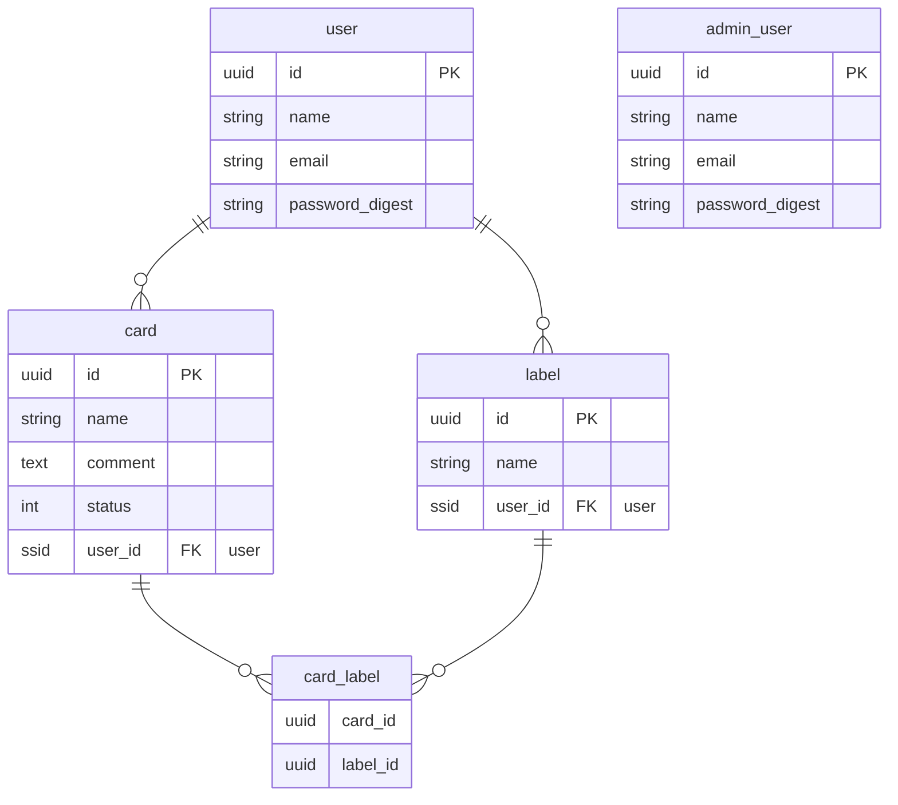

```mermaid
erDiagram
    user {
        uuid id PK
        string name
        string email
        string password_digest
    }

    card {
        uuid id PK
        string name
        text comment
        int status
        ssid user_id FK "user"
    }

    label {
        uuid id PK
        string name
        ssid user_id FK "user"
    }

    card_label {
        uuid card_id
        uuid label_id
    }

    admin_user {
        uuid id PK
        string name
        string email
        string password_digest
    }

    user ||--o{ card : ""
    user ||--o{ label : ""
    card ||--o{ card_label: ""
    label ||--o{ card_label: ""
```
